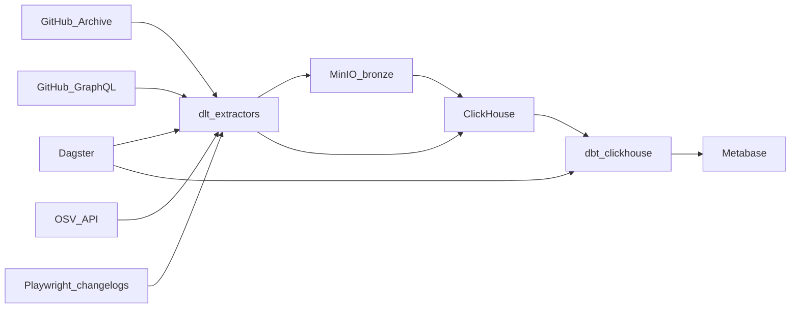

# Repo Radar — план по пунктам

Имя в резюме: **RepoRadar** — ELT-платформа для аналитики GitHub-репозиториев (Dagster, dlt, ClickHouse).

Путь: `[/home/fraizis/projects/repo-radar](/home/fraizis/projects/repo-radar)`.

Правило: не перескакивать пункты. Следующий начинается только когда у текущего выполнен «Готово, если».

## Как устроен пайплайн (напоминание)




- **Bronze** — сырые файлы в MinIO, как пришли.
- **Silver** — чистые таблицы в ClickHouse.
- **Gold** — витрины под дашборд (dbt).

Стек: Python 3.12, uv, Dagster, dlt, MinIO, ClickHouse, dbt-clickhouse, Polars, httpx, Playwright, Metabase, Docker Compose.

Объём v1: ~300 реп в seed, 3 дня GH Archive, только нужные типы событий. Не тащим Kafka/Spark/k8s.

---

## П1. Репозиторий

- Создать `/home/fraizis/projects/repo-radar` через `create_project`.
- Сразу `move_agent_to_root` на этот путь. Код писать только после переезда.
- `.gitignore`: `.env`, `.venv`, `__pycache__`, dlt state, данные.

**Готово, если:** папка — git-репо и workspace агента, пустой коммит/README-заглушка есть.

## П2. Инфраструктура

- `docker-compose.yml`: ClickHouse, MinIO, Postgres (Dagster + Metabase), Dagster webserver/daemon, Metabase.
- `infra/clickhouse/init/` — пользователи, БД `repo_radar`.
- `Makefile`: `up`, `down`, `logs`, `ch`, `ps`.
- `.env.example`: `GITHUB_TOKEN`, ключи MinIO, пароли CH/Postgres.

**Готово, если:** `make up` поднимает все сервисы, ClickHouse отвечает на `SELECT 1`, MinIO консоль открывается.

## П3. Каркас кода

- `pyproject.toml` + uv: dagster, dagster-webserver, dagster-dlt, dagster-dbt, dlt[clickhouse], dbt-clickhouse, polars, httpx, playwright, clickhouse-connect, pydantic, pytest, ruff.
- Пакет `src/repo_radar/`: пустой `definitions.py`, `resources/`, `assets/`, `extractors/`.
- `config/tracked_repos.yml` — ~300 реп Python/Go/Rust.
- `config/changelog_sources.yml` — 10–15 URL (пока можно 3–5 заглушек).
- README: схема слоёв, как поднять, какие порты.

**Готово, если:** `uv sync` проходит, `dagster definitions validate` видит пустой Definitions.

## П4. GitHub Archive → bronze → silver events

- Скачать **один** hourly `.json.gz`.
- Polars/стрим: оставить события только по seed и типам `WatchEvent`, `ForkEvent`, `ReleaseEvent`, `PullRequestEvent`, `IssuesEvent`, `PushEvent`.
- Записать Parquet в MinIO: `s3://bronze/gharchive/dt=YYYY-MM-DD/hour=HH/`.
- Загрузить в `silver_github_events`: MergeTree, `PARTITION BY toYYYYMMDD(event_time)`, `ORDER BY (repo_name, event_type, event_time, event_id)`.
- Один сырой час дополнительно класть как sample без фильтра (маленький кусок или отдельный prefix `bronze/gharchive_raw_sample/`).

**Готово, если:** в MinIO есть parquet, в CH есть строки, повторная загрузка того же часа не плодит дубли (drop partition + insert или ReplacingMergeTree).

## П5. GitHub GraphQL → silver_repos

- dlt-source: stars, language, forks, pushedAt, description по seed.
- Bronze в MinIO, silver: `silver_repos` ReplacingMergeTree по `updated_at`.
- Нужен `GITHUB_TOKEN` в `.env`. Rate limit + пагинация.

**Готово, если:** таблица реп заполнена, повторный прогон обновляет, а не дублирует.

## П6. dbt: silver → gold

Проект в `transform/`:

- staging-вьюхи на silver-таблицах;
- `gold_repo_daily` — stars/forks/pushes/PRs за день;
- `gold_language_trends`;
- `gold_rising_repos` — прирост Watch/Fork за 7 дней;
- тесты: `not_null`, unique `event_id`, freshness;
- `dbt docs` / описание моделей.

Пока без OSV: `gold_cve_exposure` — заглушка или пункт П7.

**Готово, если:** `dbt build` зелёный на данных П4–П5, витрины отвечают на простые SELECT.

## П7. OSV + Playwright

- OSV API по ecosystem/package из seed → bronze + `silver_advisories`.
- dbt: `gold_cve_exposure`.
- Playwright: changelog URL из конфига → version, date, headings → `silver_changelogs`.
- robots.txt, backoff, checkpoint по URL. Не краулить весь интернет.

**Готово, если:** обе сущности в CH, dbt-модель CVE строится, хотя бы 3 changelog реально спарсены.

## П8. Dagster как оркестратор

Склеить в assets с зависимостями:

1. `bronze_gharchive` → `silver_github_events`
2. `bronze_github_repos` → `silver_repos`
3. `bronze_osv` / `bronze_changelogs`
4. `dbt_build`
5. Asset checks: row count > 0, свежесть, аномалия объёма vs медиана (на коротком окне можно упростить).

Schedule: раз в час — новый GH Archive hour; GraphQL/OSV — реже (раз в 6–12 ч).

**Готово, если:** в Dagster UI виден lineage, один job прогоняет цепочку end-to-end.

## П9. Демо и резюме

Metabase (порт 3000):

- Repo pulse: события по дням и типам
- Rising repos за 7 дней
- Language trends
- CVE exposure

Дальше:

- `make demo`: up + backfill 3 дня + dbt + печать URL (Metabase :3000, Dagster :3001).
- README: схема, запуск, скриншоты, блок «что было бы в проде».
- Формулировка в резюме: «RepoRadar — ELT-платформа для аналитики GitHub-репозиториев (Dagster, dlt, dbt, ClickHouse): GitHub Archive + API + scraping → MinIO → medallion, инкремент, тесты качества, дашборды».

**Готово, если:** с нуля `make up` + токен + `make demo` даёт дашборды с данными за 3 дня.

---

## Структура репо (после П3)

```text
repo-radar/
  README.md
  docker-compose.yml
  Makefile
  pyproject.toml
  .env.example
  config/tracked_repos.yml
  config/changelog_sources.yml
  infra/clickhouse/init/
  src/repo_radar/
  transform/
  tests/
```

## Вне v1

Kafka, Spark, Iceberg, Airflow, Kubernetes, HH API.

После П9, если останется время: ClickHouse S3Queue, алерты в Slack, CI (`ruff` + `dbt parse` + pytest).